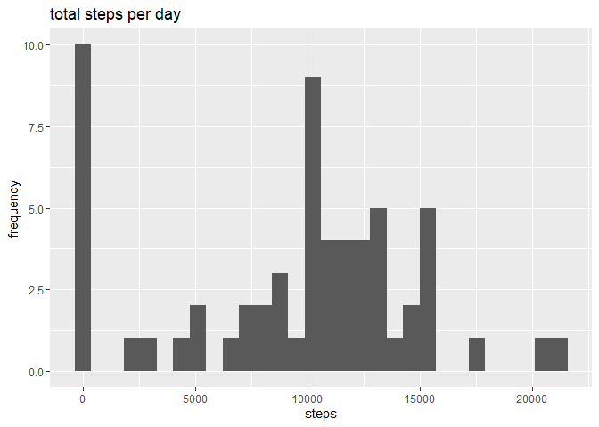
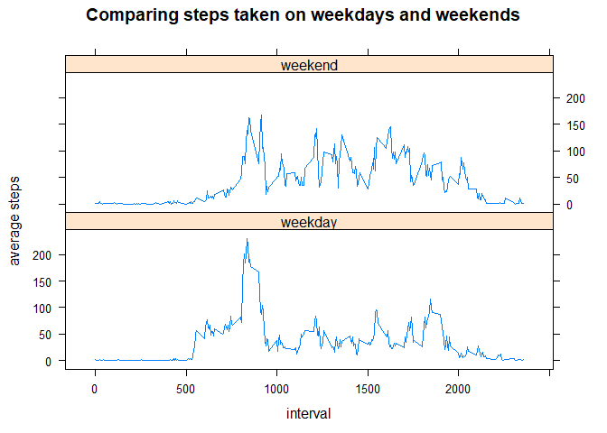

## Loading and preprocessing the data

The data for this activity is pre loaded into this folder. Initially I used read.csv with unzip to load the zipped csv file


```r
activitydata <- read.csv(unzip("./activity.zip"))
```

Inspect the first rows of the activitydata file to check formatting


```r
head(activitydata)
```

```
##   steps       date interval
## 1    NA 2012-10-01        0
## 2    NA 2012-10-01        5
## 3    NA 2012-10-01       10
## 4    NA 2012-10-01       15
## 5    NA 2012-10-01       20
## 6    NA 2012-10-01       25
```

and also check dimensions of activitydata to confirm that it has 3 rows and 17568 entries


```r
dim(activitydata)
```

```
## [1] 17568     3
```

## What is mean total number of steps taken per day?

Load the dplyr library and group the data by date. Calculate total number of steps taken per day.


```r
library(dplyr)
```

```
## 
## Attaching package: 'dplyr'
```

```
## The following objects are masked from 'package:stats':
## 
##     filter, lag
```

```
## The following objects are masked from 'package:base':
## 
##     intersect, setdiff, setequal, union
```

```r
bydate <- group_by(activitydata, date)
steps <- summarise(bydate, "total" = sum(steps, na.rm = TRUE))
```

Load the ggplot2 library to create a histogram of this data


```r
library(ggplot2)
qplot(steps$total, geom = "histogram", xlab = "steps", ylab = "frequency", main = "total steps per day")
```

```
## `stat_bin()` using `bins = 30`. Pick better value with `binwidth`.
```

<!-- -->

Calculate the mean of the total number of steps per day


```r
mean(steps$total)
```

```
## [1] 9354.23
```

Calculate the median of the total number of steps per day


```r
median(steps$total)
```

```
## [1] 10395
```

## What is the average daily activity pattern?

Group the activitydata by time intervals and find mean number of steps within a time interval. Plot a line graph of this data.


```r
byinterval <- group_by(activitydata, interval)
dailypattern <- summarise(byinterval, "avgsteps" = mean(steps, na.rm = TRUE))
plot(dailypattern$interval, dailypattern$avgsteps ,type = "l", xlab = "interval", ylab = "average steps")
```

<!-- -->

Finding the time interval corresponding to the higest average daily steps


```r
busy <- dailypattern[dailypattern$avgsteps ==  max(dailypattern$avgsteps),1]
```

the time interval when average daily steps is higest is 835

## Imputing missing values

Note that there are NA values in the data, check the number of NA values


```r
sum(is.na(activitydata$steps))
```

```
## [1] 2304
```

Remove these by using the dailypattern data to imput the mean value for this time interval in place of NA


```r
x <- 0
activitydata2 <- activitydata
for (x in 1:nrow(activitydata2)){
  
  if (is.na(activitydata2[x,1]) == TRUE) {
    int <- activitydata2[x,3]
    activitydata2[x,1] <- dailypattern[dailypattern$interval == int,2]
  }
}
```


Then find the total number of steps taken each day, after replacing NA values


```r
bydate2 <- group_by(activitydata2, date)
steps2 <- summarise(bydate2, "total" = sum(steps, na.rm = TRUE))
```

Create a histogram showing steps per day


```r
qplot(steps2$total, geom = "histogram", xlab = "steps", ylab = "frequency", main = "total steps per day")
```

```
## `stat_bin()` using `bins = 30`. Pick better value with `binwidth`.
```

<!-- -->

Calculate the mean of the total number of steps per day

```r
mean(steps2$total)
```

```
## [1] 10766.19
```

Calculate the median of the total number of steps per day

```r
median(steps2$total)
```

```
## [1] 10766.19
```

## Are there differences in activity patterns between weekdays and weekends?

Use the weekdays function to classify data as either weekdays or weekends. 


```r
weekend <- (weekdays(as.Date(activitydata2$date)) == "Saturday") | (weekdays(as.Date(activitydata2$date)) == "Sunday")
activitydata2 <- cbind(activitydata2, weekend)
activitydata2 <- mutate(activitydata2, daytype = factor(weekend, labels = c("weekday","weekend")))
activitydata2 <- activitydata2 %>%
  select(steps,date,interval,daytype)
```

Now plot the mean steps by interval showing the difference between weekends and weekdays using the lattice plotting package to show the data.


```r
groupintervals <- group_by(activitydata2,interval, daytype)
dailypattern <- summarise(groupintervals, "avgsteps" = mean(steps))

library(lattice)
xyplot(avgsteps ~ interval | daytype, data = dailypattern, type = "l", layout = c(1,2), xlab = "interval", ylab = "average steps", main = "Comparing steps taken on weekdays and weekends")
```

<!-- -->
